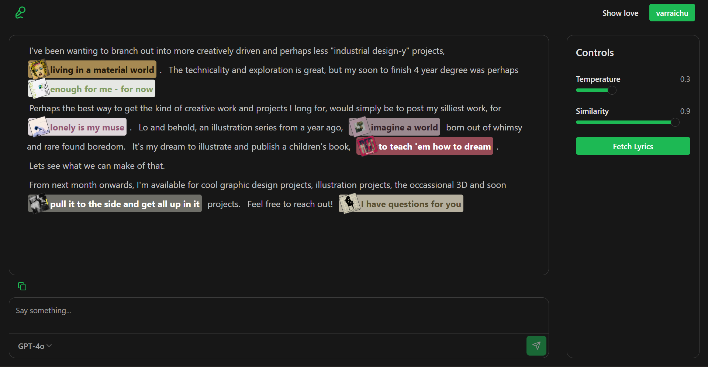

# SingedIn
## Overview

SingedIn is a new take on AI slop that has been circulating on almost everyone's Linkedn post. It's not about posting -- it's about getting your message across. Just kidding, this readme is not AI generated, so you can read on. SingedIn is not aimed at solving the slop posts problem, in fact, it is aimed at making the slop as brainrotted as possible by injecting Spotify lyrics into well formed sentences, with the help of ChatGPT. You enter your prewritted post as input and out comes an enhanced version of it, filled with lyrics from choruses of your liked songs on Spotify. 
It works by first fetching a list of your liked songs on spotify, as well as the url of their associated album artwork and storing it as a JSON file. Then, using the LyricsGenius library for python, the json is read, and lyrics for the songs are fetched from Genius and stored in their txt files. Non-english lyrics and files with no lyrics are separated into their own folders. The lyrics are then chunked and stored into a local instance of ChromaDB. Then, with the help of langchain, the user's input text is broken into chunks. For each line, the relevant songs are retrieved through the vector database and then inserted into ChatGPT to modify. The final output is then passed to the user. 

### Limitations
There are some limitations to this method, the most evident one being having to enter your text into it. It does not automatically generate the post for you before infusing it. However, you do not have to prompt it to add the lyrics, as it is built to do that. Moreover, it can sometimes pick lyrics that might not be the best fit, and the grammar can also be wrong. LyricsGenius can sometimes also fetch completely wrong lyrics for some songs, which can lead to erroneous results, or simply not fetch lyrics for songs. In such cases, a missing_songs.json file is created to help you keep track of what songs were not fetched.
I could not deploy this as a webapp because Spotify has placed [restrictions](https://developer.spotify.com/documentation/web-api/concepts/quota-modes) on individual developers from accessing their API. You can however, run it locally and fetch a list of your liked songs.
Now that you have an idea of the service, let's take a deep dive into it.

---

## Spotify setup explained
Accessing user data on Spotify first requires you to sign up for the [developer account.](https://developer.spotify.com/documentation/web-api/tutorials/getting-started) 
Once done, you have to enter the Redirect URI in the dashboard of your app. Make sure that the redirect uri is the one where your frontend is running, eg 125.0.0.1:5000. This is crucial because it is needed to send you back to the frontend once you have logged in. Spotify implements OAUTH2 authorization, so when you hit the login endpoint, you are first redirected to Spotify and asked to give access to your playlists and data. The type of data you can give access to can be defined in the scopes variable of the request. Once access is granted, the callback method in the backend is called and the access token and refresh tokens are stored as cookies in the browser. The access token is then required to make subsequent calls to fetch the user's account information and liked songs.

The process is throughly explained in the documentation [here.](https://developer.spotify.com/documentation/web-api/tutorials/code-flow)

You can then call the lyrics endpoint to fetch lyrics. It has a helper file that preprocesses the data to only keep the choruses and bridges of the song and remove any other data. It also makes sure the txt files are in utf-8 format, because I was getting an issue into reading data and storing them in the vector database that was not utf-8. 
> ONLY RUN THE LYRICS ENDPOINT ONCE WHEN YOU DO NOT HAVE THE LYRICS FETCHED AND THE CHROMADB IS EMPTY. IF YOU RUN IT AGAIN, IT WILL OVERWRITE YOUR ALREADY FETCHED DATA AND DEPENDING ON YOUR LIKED SONGS, TAKE A LOT OF TIME.

---

## ML choices explained
### Chunking and retrieval:
The lyrics are chunked based on a recursive text splitter to make sure there are small sections. However the entered paragraph is chunked into separate sentences using the nltk library. I did this because I wanted to create diversity in the lyrics, while making sure that the text structure is intact and for every sentence we get a candidate lyric if possible. I also used a multi query retriever to find more diverse results as it generates different queries from the original one to find relevant content. I also added the ability to modify temperature and similarity for more fun and interesting results.
The process then becomes: Split the paragraphs into separate paragraphs. Then for each paragraph, split sentences, send the previous and next sentence along with the current for context, along with the retrieved lyrics. Once everything is done, the paragraphs are combined and the output is sent to the frontend.

---

## Frontend overview
Frontend was built using React. I used shadcn and ai libraries to make the UI similar to how LLM playgrounds look. I wanted it to be expressive and show where and what songs are added.



---

## Setup and Running

### Prerequisites
- Python installed on your system
- `uv` installed (`pip install uv`)
- Spotify developer credentials set up
- Environment variables configured (see `.env.example` if present)

### Backend Setup

Navigate to the backend directory:

```powershell
cd "fast-backend"
```

#### Create and activate the virtual environment:

```uv venv
& ".venv/Scripts/Activate.ps1"
```

#### Install dependencies:

```uv sync
```

#### Running the Backend

Once the virtual environment is activated, start the FastAPI development server:

```uv run fastapi dev main.py
```

The backend will start in development mode and be available at the default FastAPI address.

> Make sure the virtual environment is activated before running the server, otherwise dependencies may not be resolved correctly.

### Frontend Setup

Navigate to the frontend directory:

```powershell
cd "frontend"
```

#### Install packages:

```npm i
```

#### Running the Backend

Start the frontend:

```npm run dev
```

> The frontend will show that it is exposed on http://localhost:5173/ or http://10.0.0.106:5173/ but you will need to access it at http://127.0.0.1:5173/

---

## Sources
https://developer.spotify.com/documentation/web-api
https://lyricsgenius.readthedocs.io/en/master/
https://docs.langchain.com/oss/python/langchain/overview
https://ai-sdk.dev/getting-started

### Chunking and retrieval
https://jayant017.medium.com/rag-using-langchain-part-4-retrievers-79908145e28c
https://www.pinecone.io/learn/chunking-strategies/
https://medium.com/@adergunov/maximal-marginal-relevance-144c23b42be5
https://github.com/FullStackRetrieval-com/RetrievalTutorials/blob/main/tutorials/LevelsOfTextSplitting/5_Levels_Of_Text_Splitting.ipynb